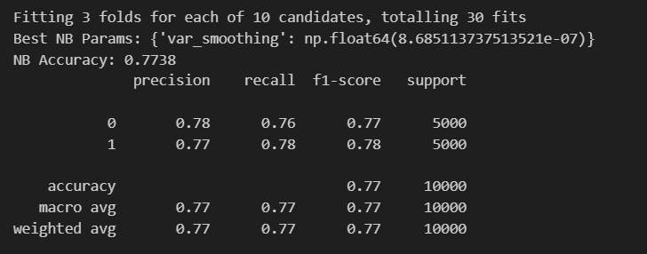
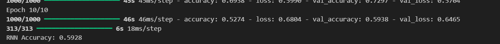
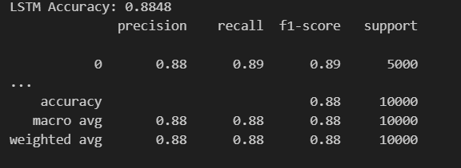

# IMDb Sentiment Analysis using ML & Deep Learning

This project performs sentiment analysis on movie reviews from the IMDb dataset.
It compares traditional machine learning with deep learning models using custom NLP preprocessing and Word2Vec embeddings.
## Link
https://imdb-sentiment-analysis-n3sn3tmseveqf8ljtzvxd2.streamlit.app/
## Project Overview

We classify movie reviews as Positive or Negative using:


Naive Bayes	Word2Vec averaged embeddings
RNN	Word2Vec embedding layer + SimpleRNN
LSTM	Word2Vec embedding layer + LSTM


## Project Structure

```
imdb-sentiment-analysis/
│
├── app.py                      # Streamlit web app
├── naive_bayes_w2v.pkl         # Saved Naive Bayes model
├── rnn_sentiment_model.h5      # Saved RNN model
├── lstm_sentiment_model.h5     # Saved LSTM model
├── tokenizer.pkl               # Tokenizer for text sequences
├── word2vec.model              # Trained Word2Vec embeddings
├── requirements.txt            # Dependencies
└── README.md                   # Project documentation
```


## Dataset

We use the IMDb movie review dataset available in TensorFlow.

50,000 movie reviews

Balanced positive and negative samples

split: 80% training / 20% testing

## Text Preprocessing

Decode integer reviews back to text

Remove special characters

Tokenize using NLTK

Remove stopwords

Lemmatize words

Train Word2Vec embeddings

## Models Used
### Naive Bayes

Input: Average Word2Vec vectors

Tuning: RandomizedSearchCV

Fast baseline classifier

### RNN (SimpleRNN)

Input: Word2Vec embedding matrix

Learns sequence patterns in reviews

### LSTM

Handles long-term dependencies

Typically gives the best accuracy

## Saved Models

After training, the following are saved:

naive_bayes_w2v.pkl
rnn_sentiment_model.h5
lstm_sentiment_model.h5
tokenizer.pkl	
word2vec.model	

These are used by the Streamlit app.


Example Test Sentences

Positive:
This movie was absolutely fantastic, I loved every minute of it.

Negative:
This movie was so bad I hated every minute of it.

## Results 
Performance metrics of all the algorithms
### Naive Bayes

### RNN	

### LSTM
	
## Future Improvements

Handling of emojis